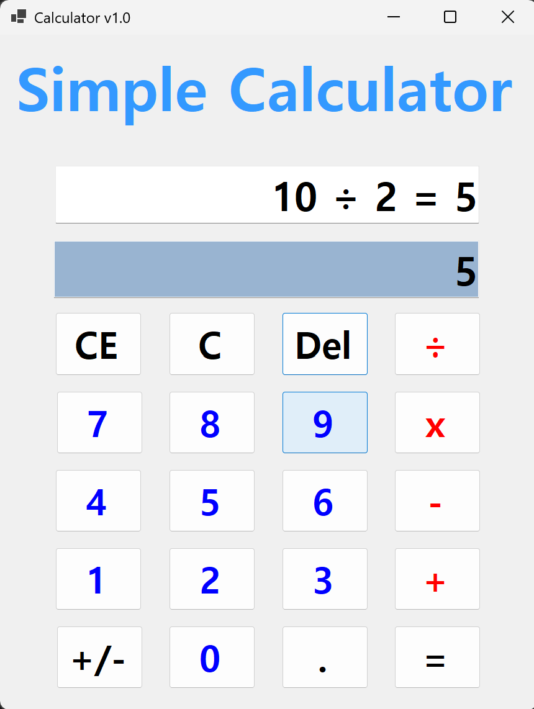
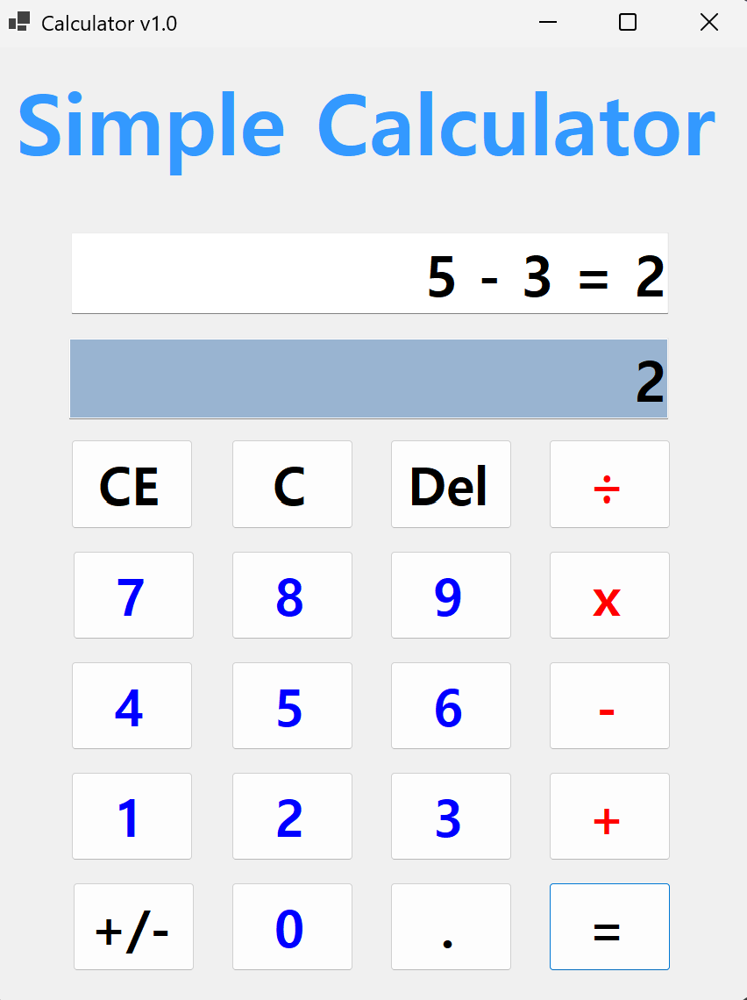
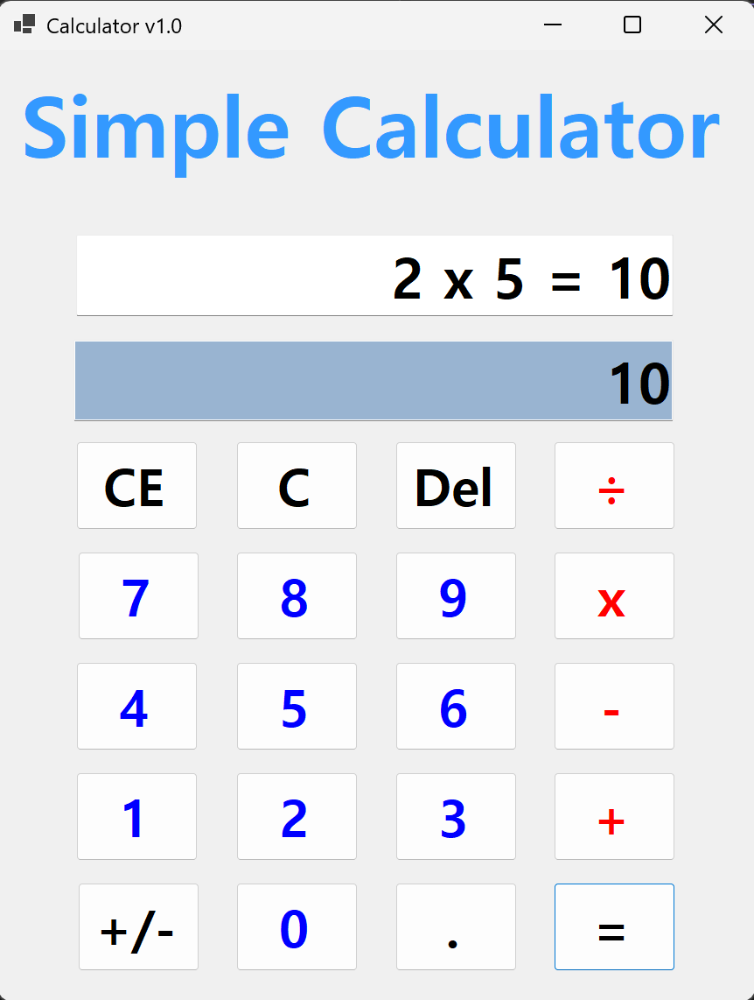

# (C# 코딩) 심플 계산기 v1.0

## 개요
- C# 프로그래밍 학습
- 1줄 소개: 사칙연산 우선순위 자동 계산 및 실시간 수식 업데이트 기능을 갖춘 윈도우 스타일 계산기
- 사용한 플랫폼:
  - C#, .NET Windows Forms, Visual Studio, GitHub
- 사용한 컨트롤:
  - Label, TextBox, Button
- 사용한 기술과 구현한 기능:
  - Visual Studio를 이용하여 UI 디자인
  - DataTable 클래스를 이용한 수식 문자열 분석 및 사칙연산 우선순위 처리
  - KeyPreview 속성과 KeyDown 이벤트를 활용한 풀 키보드 입력 시스템 구현
  - Double 데이터 타입을 통한 소수점 이하 정밀 연산 및 형변환 예외 처리

- 실습 중에 구현한 기능들 설명
- 실시간 수식 업데이트 알고리즘 (입력 과정과 결과값의 데이터 동기화)
- 사용자 정의 삭제 로직 (CE/Del 클릭 시 '0'이 아닌 빈 문자열 처리 및 예외 방지)
- try-catch 구문을 적용한 수식 구문 오류 검증 및 프로그램 안정화
- 부호 반전(+/-) 및 소수점(.) 입력을 통한 윈도우 표준 계산기 기능 구현

## 실행 화면 (과제1)
- 과제1 코드의 실행 스크린샷
(img/1.png)
- 과제 내용
- Label(표시), TextBox(입력), Button(전송), ListBox(대화창)를 적절히 배치합니다.
- 전송 버튼 클릭 시 TextBox의 텍스트를 ListBox의 항목(Items)으로 추가합니다.
- 추가 직후 TextBox의 내용을 비워(Clear) 다음 입력을 준비합니다.
- 구현 내용과 기능 설명
- 입력창에 메시지 입력하고 전송 버튼을 누르면 메시지가 리스트 박스에 표시된다.
- 계속 반복하면 메시지가 리스트 박스에 한 줄씩 계속 추가된다.
- 추가 내용이 많아지면 리스트 박스에 스크롤바가 자동으로 생기고 스크롤된다.

## 실행 화면 (과제2)
- 과제2 코드의 실행 스크린샷

- 과제 내용
- Label(표시), TextBox(입력), Button(전송), ListBox(대화창)를 적절히 배치합니다.
- 전송 버튼 클릭 시 TextBox의 텍스트를 ListBox의 항목(Items)으로 추가합니다.
- 추가 직후 TextBox의 내용을 비워(Clear) 다음 입력을 준비합니다.
- 구현 내용과 기능 설명
- 입력창에 메시지 입력하고 전송 버튼을 누르면 메시지가 리스트 박스에 표시된다.
- 계속 반복하면 메시지가 리스트 박스에 한 줄씩 계속 추가된다.
- 추가 내용이 많아지면 리스트 박스에 스크롤바가 자동으로 생기고 스크롤된다.

## 실행 화면 (과제3)
- 과제3 코드의 실행 스크린샷

- 과제 내용
- Label(표시), TextBox(입력), Button(전송), ListBox(대화창)를 적절히 배치합니다.
- 전송 버튼 클릭 시 TextBox의 텍스트를 ListBox의 항목(Items)으로 추가합니다.
- 추가 직후 TextBox의 내용을 비워(Clear) 다음 입력을 준비합니다.
- 구현 내용과 기능 설명
- 입력창에 메시지 입력하고 전송 버튼을 누르면 메시지가 리스트 박스에 표시된다.
- 계속 반복하면 메시지가 리스트 박스에 한 줄씩 계속 추가된다.
- 추가 내용이 많아지면 리스트 박스에 스크롤바가 자동으로 생기고 스크롤된다.

## 실행 화면 (과제4)
- 과제4 코드의 실행 스크린샷

- 과제 내용
- Label(표시), TextBox(입력), Button(전송), ListBox(대화창)를 적절히 배치합니다.
- 전송 버튼 클릭 시 TextBox의 텍스트를 ListBox의 항목(Items)으로 추가합니다.
- 추가 직후 TextBox의 내용을 비워(Clear) 다음 입력을 준비합니다.
- 구현 내용과 기능 설명
- 입력창에 메시지 입력하고 전송 버튼을 누르면 메시지가 리스트 박스에 표시된다.
- 계속 반복하면 메시지가 리스트 박스에 한 줄씩 계속 추가된다.
- 추가 내용이 많아지면 리스트 박스에 스크롤바가 자동으로 생기고 스크롤된다.